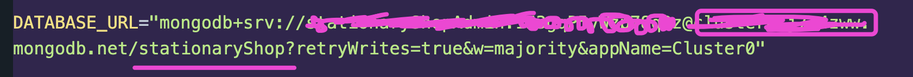

# Blog Web Application

This application provides the backend for a blogging platform where users can create, update, and manage their blogs. The platform includes secure authentication, role-based access control, and a public API for viewing blogs. The system is designed with two roles: Admin and User, each with specific permissions and functionalities.

## 🟪 Live Server Link:

https://blog-project-server-mu.vercel.app/

## 🟪 Technologies used:

-  NodeJs/ ExpressJs as server
-  Mongoose as ODM
-  MongoDB as database
-  TypeScript
-  Zod (Validation purpose)

## 🟪 Features:

### User Roles

Admin:

-  Can delete any blog.

-  Can block any user by updating a property isBlocked.

-  Cannot update any blog.

User:

-  Can register and log in.

-  Can create, update, and delete their own blogs.

-  Cannot perform admin actions.

### Authentication & Authorization

Authentication:

-  Users must log in to perform write, update, and delete operations.

Authorization:

-  Secure differentiation between Admin and User roles.

### Blog API

A public API for reading blogs:

-  Displays blog title, content, author details, and other information.

Supports:

-  Search

-  Sorting

-  Filtering

## 🟪 Setup Instructions

First make sure you have `node` installed in your machine.

Check it using this command on the terminal:

```
node -v
```

If, node is not installed, install it following the guideline and install the LTS(Long term support) version of it.

https://nodejs.org/en

If node version is found then:

### 👉 Step 1: Download or Clone the GitHub repository

Clone command:

```
git clone https://github.com/NoorTushar/blog-project-server.git
```

### 👉 Step 2: Open the project folder in the terminal

Go to the folder and open it in the terminal.

You can also open the folder using the terminal by following command:

```
cd <project-folder-name>
```

### 👉 Step 3: Install dependencies

Run the following command:

```
npm install
```

It will download all the necessary node packages needed for the project.

### 👉 Step 4: Open the folder using VSCode or any of your preferred code editor.

Manually open the folder in your editor or you can use this command to open:

```
code .
```

### 👉 Step 5: Create a `.env` file in the root folder

Create a `.env` and add your mongoDB url and port number.

```
PORT=give your port number here.

DATABASE_URL=give your mongo db uri here.

BCRYPT_SALT_ROUNDS=give your bcrypt salt number here.

JWT_ACCESS_SECRET=give your jwt secret key here.
```

For database url make sure to mention your database name(the one you want to create) shown below:



### 👉 Step 6: Run the following commands according to your requirements:

#### 1. To start server locally:

```
npm run start:dev
```

#### 2. to convert all the TypeScript files into JavaScript files (which will be stored in the dist folder):

```
npm run build
```

## 🟪 API Endpoints

### 1. Authentication

👉 Register User
POST `/api/auth/register`

👉 Login User
POST `/api/auth/login`

### 2. Blog Management

👉 Create Blog
POST `/api/blogs`

👉 Update Blog
PATCH `/api/blogs/:id`

👉 Delete Blog
DELETE `/api/blogs/:id`

👉 Get All Blogs (Public)
GET `/api/blogs`

⚡️ Query Parameters:

-  search: Search blogs by title or content (e.g., search=blogtitle).
-  ortBy: Sort blogs by specific fields such as createdAt or title (e.g., sortBy=title).
-  sortOrder: Defines the sorting order. Accepts values asc (ascending) or desc (descending). (e.g., sortOrder=desc).
-  filter: Filter blogs by author ID (e.g., author=authorId).

### 3. Admin Actions

👉 Block User
PATCH `/api/admin/users/:userId/block`

👉 Delete Blog
DELETE `/api/admin/blogs/:id`
